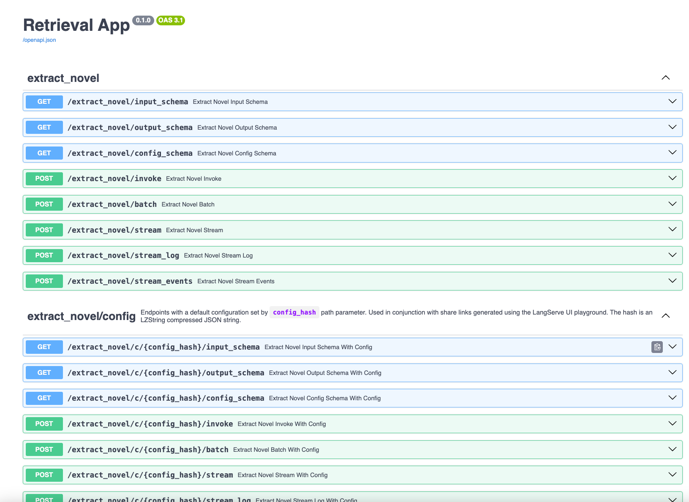
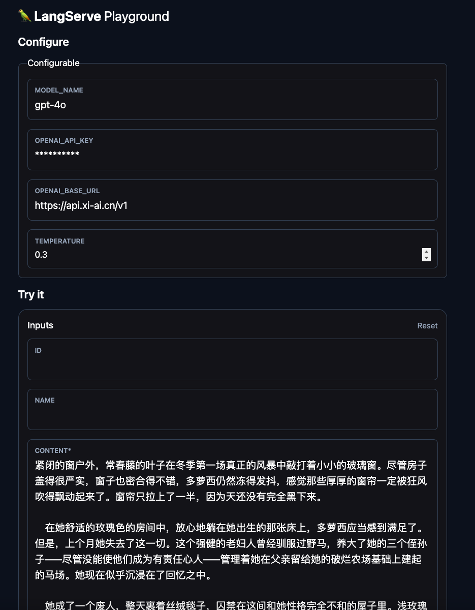
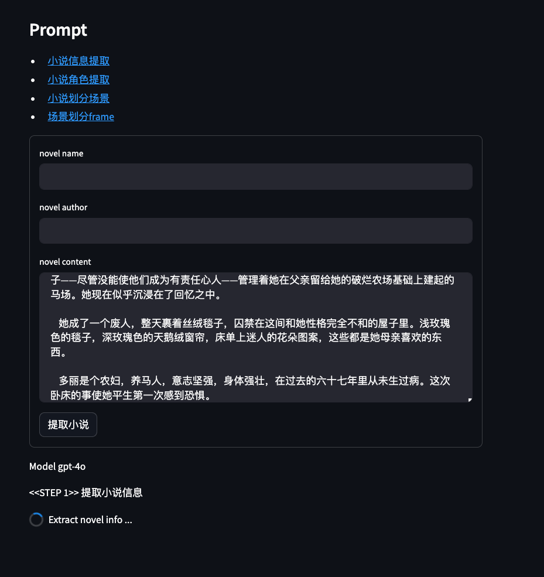

# Chimera

Have a wonderful adverture in a virtual world.

## Install

```shell
conda create -n chimera python==3.10.14
conda activate chimera
pip install -r requirements.txt
```

## Deploy

```shell
python server.py # The default host is "localhost" with port "8000"
```

Visit "http://localhost:8000/docs" to access API documentation.



Visit "http://localhost:8000/{chain_name}/playground" to access chain playground and test its performance.



## webui

```shell
streamlit run webui.py
```


